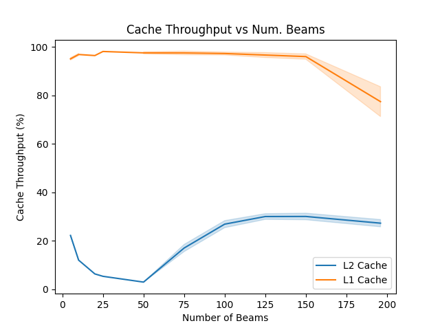
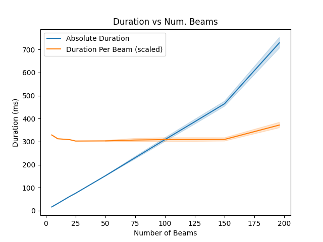
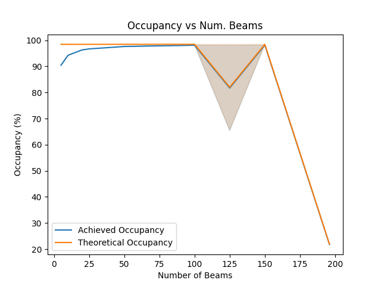
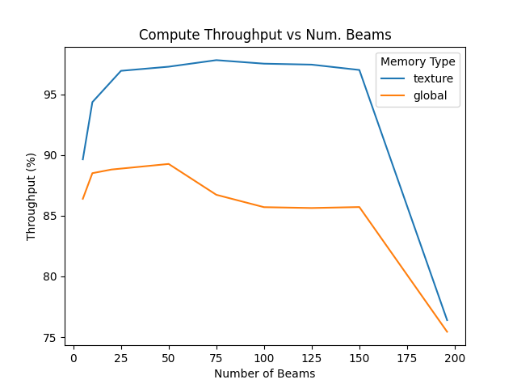
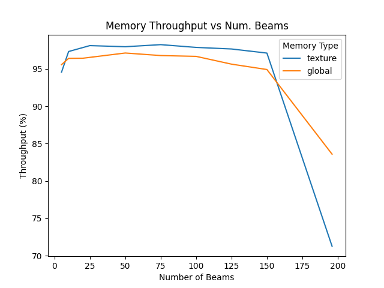
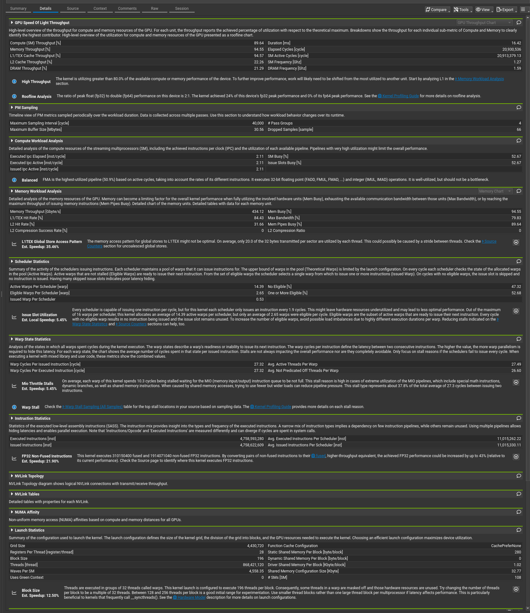

# Beamformer

## Summary
This is a beamformer written using CUDA as a learning exercise. It can handle a maximum of 196 beams.

The weights & phase offsets are currently set to convenient values to allow easy checking of validity.

## Learnings

- Constant memory should be reserved for small values only:
  - The weights needed to be accessed over and over again, I tried to cache them in constant memory. This caused a memory IO bottleneck & performance was far better using them in global memory with const \_\_restrict\_\_. Very slightly better was using texture memory which I ended up using at the end.
  - Constant memory bottleneck showed up as very high ADU pipe utilization.
- Storing intermediate values in shared memory and then summing was far faster than using atomicAdd.
- I tried to read all beamweights for each thread all at once, but reading many floats from adjacent memory was slower than storing them separately and reading NUM_BEAMS times.
- #pragma unroll gives a modest speed-up for small loops.
- Tracking method & outcomes using MLFlow was very useful:
  - Inject a small payload into the code to run that saves parameters & outputs.
  - Saves out to a git repository for back-ups.
  - Saves my thought process as well as actual code files & Nsight-compute reports.
- Learned to use Nsight-Compute better.

## What I would do differently for higher numbers of beams
This kernel can only handle 196 beams as 196 is the number of threads in each block. This could be updated to handle more, but I think a different architecture would be more efficient for higher number of beams.

The main issue will be that the shared memory will grow with the number of beams, and will become a bottleneck. Therefore, instead of calculating all beams and then writing, we can write at the end of calculating the beam.

This would require a constant amount of shared memory, but would require many more \_\_syncthreads() operations.

## Performance vs Number of Beams

Shaded regions show spread of different memory types (global vs texture) when they are not explicitly split out.

There was an approximately linear increase in duration for an increase in number of beams.

